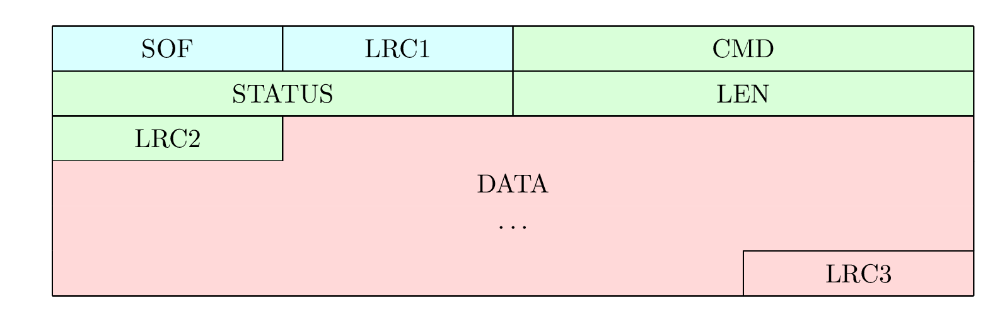

# Protocol description

**WIP**

## Frame format

The communication between the firmware and the client is made of frames structured as follows:

- **SOF**: `1 byte`, "**S**tart-**O**f-**F**rame byte" represents the start of a packet, and must be equal to `0x11`.
- **LRC1**: `1 byte`, LRC over `SOF` byte, therefore must be equal to `0xEF`.
- **CMD**: `2 bytes`, each command have been assigned a unique number (e.g. `DATA_CMD_SET_SLOT_TAG_NICK` = `1007`).
- **STATUS**: `2 bytes`.
  - From client to firmware, the status is always `0x0000`.
  - From firmware to client, the status is the result of the command.
- **LEN**: `2 bytes`, length of the `DATA` field, maximum is `512`.
- **LRC2**: `1 byte`, LRC over `CMD|STATUS|LEN` bytes.
- **DATA**: `LEN bytes`, data to be sent or received, maximum is `512 bytes`. This payload depends on the exact command or response to command being used. See [Packet payloads](#packet-payloads) below.
- **LRC3**: `1 byte`, LRC over `DATA` bytes.

Notes:
* The same frame format is used for commands and for responses.
* All values are **unsigned** values, and if more than one byte, in **network byte order**, aka [Big Endian](https://en.wikipedia.org/wiki/Endianness) byte order.
* The total length of the packet is `LEN + 10` bytes, therefore it is between `10` and `522` bytes.
* The LRC ([**L**ongitudinal **R**edundancy **C**heck](https://en.wikipedia.org/wiki/Longitudinal_redundancy_check)) is the 8-bit two's-complement value of the sum of all bytes modulo $2^8$.
* LRC2 and LRC3 can be computed equally as covering either the frame from its first byte or from the byte following the previous LRC, because previous LRC nullifies previous bytes LRC computation.
E.g. LRC3(DATA) == LRC3(whole frame)

## Data payloads

Each command and response have their own payload formats.

Standard response status is `STATUS_DEVICE_SUCCESS`.

**TODO:** check all status responses in all commands with `hw raw`

Beware, slots in protocol count from 0 to 7.

### 1000: GET_APP_VERSION
* Command: no data
* Response: 2 bytes: `version_major|version_minor`
### 1001: CHANGE_DEVICE_MODE
* Command: 1 byte. `0x00`=emulator mode, `0x01`=reader mode
* Response: no data
### 1002: GET_DEVICE_MODE
* Command: no data
* Response: data: 1 byte. `0x00`=emulator mode, `0x01`=reader mode
### 1003: SET_ACTIVE_SLOT
* Command: 1 byte. `slot_number` between 0 and 7
* Response: no data
### 1004: SET_SLOT_TAG_TYPE
* Command: 3 bytes. `slot_number|tag_type[2]` with `slot_number` between 0 and 7 and `tag_type` according to `tag_specific_type_t` enum.
* Response: no data

**TODO:** remap `tag_specific_type_t` enum. Maybe dissociate LF & HF types in 2 enums
### 1005: SET_SLOT_DATA_DEFAULT
* Command: 3 bytes. `slot_number|tag_type[2]` with `slot_number` between 0 and 7 and `tag_type` according to `tag_specific_type_t` enum.
* Response: no data

**TODO:** remap `tag_specific_type_t` enum. Maybe dissociate LF & HF types in 2 enums
### 1006: SET_SLOT_ENABLE
* Command: 2 bytes. `slot_number|enable` with `slot_number` between 0 and 7 and `enable` = `0x01` to enable, `0x00` to disable
* Response: no data
### 1007: SET_SLOT_TAG_NICK
* Command: 2+n bytes. `slot_number|sense_type|name[n]` with `slot_number` between 0 and 7, `sense_type` according to `tag_sense_type_t` enum and `name` a UTF-8 encoded string of max 32 bytes, no null terminator.
* Response: no data

**TODO:** rewrite cmd unpack
### 1008: GET_SLOT_TAG_NICK
* Command: 2 bytes. `slot_number|sense_type` with `slot_number` between 0 and 7 and `sense_type` according to `tag_sense_type_t` enum.
* Response: a UTF-8 encoded string of max 32 bytes, no null terminator. If no nick name has been recorded in Flash, response status is `STATUS_FLASH_READ_FAIL`.

**TODO:** rewrite cmd unpack
### 1009: SLOT_DATA_CONFIG_SAVE
* Command: no data
* Response: no data
### 1010: ENTER_BOOTLOADER
* Command: no data
* Response: this special command does not return and will interrupt the communication link while rebooting in bootloader mode, needed for DFU.
### 1011: GET_DEVICE_CHIP_ID
* Command: no data
* Response: 8 bytes. nRF `DEVICEID[8]` in Network byte order.
### 1012: GET_DEVICE_ADDRESS
* Command: no data
* Response: 6 bytes. nRF `DEVICEADDR[6]` in Network byte order. First 2 MSBits forced to `0b11` to match BLE static address.
### 1013: SAVE_SETTINGS
* Command: no data
* Response: no data
### 1014: RESET_SETTINGS
* Command: no data
* Response: no data
### 1015: SET_ANIMATION_MODE
* Command: 1 byte, according to `settings_animation_mode_t` enum.
* Response: no data
### 1016: GET_ANIMATION_MODE
* Command: no data
* Response: 1 byte, according to `settings_animation_mode_t` enum.
### 1017: GET_GIT_VERSION
* Command: no data
* Response: n bytes, a UTF-8 encoded string, no null terminator.
### 1018: GET_ACTIVE_SLOT
* Command: no data
* Response: 1 byte
### 1019: GET_SLOT_INFO
* Command: no data
* Response: 32 bytes, 8 tuples `hf_tag_type[2]|lf_tag_type[2]` according to `tag_specific_type_t` enum, for slots from 0 to 7

**TODO:** remap `tag_specific_type_t` enum. Maybe dissociate LF & HF types in 2 enums
### 1020: WIPE_FDS
* Command: no data
* Response: no data. Status is `STATUS_DEVICE_SUCCESS` or `STATUS_FLASH_WRITE_FAIL`. The device will reboot shortly after this command.
### 1023: GET_ENABLED_SLOTS
* Command: no data
* Response: 8 bytes, 8 bools = `0x00` or `0x01`, for slots from 0 to 7
### 1024: DELETE_SLOT_SENSE_TYPE
* Command: 2 bytes. `slot_number|sense_type` with `slot_number` between 0 and 7 and `sense_type` according to `tag_sense_type_t` enum.
* Response: no data
### 1025: GET_BATTERY_INFO
* Command: no data
* Response: 3 bytes, `voltage[2]|percentage`
### 1026: GET_BUTTON_PRESS_CONFIG
* Command: 1 byte. Char `A` or `B` (`a`/`b` tolerated too)
* Response: 1 byte, `button_function` according to `settings_button_function_t` enum.
### 1027: SET_BUTTON_PRESS_CONFIG
* Command: 2 bytes. `button|button_function` with `button` char `A` or `B` (`a`/`b` tolerated too) and `button_function` according to `settings_button_function_t` enum.
* Response: no data
### 1028: GET_LONG_BUTTON_PRESS_CONFIG
* Command: 1 byte. Char `A` or `B` (`a`/`b` tolerated too)
* Response: 1 byte, `button_function` according to `settings_button_function_t` enum.
### 1029: SET_LONG_BUTTON_PRESS_CONFIG
* Command: 2 bytes. `button|button_function` with `button` char `A` or `B` (`a`/`b` tolerated too) and `button_function` according to `settings_button_function_t` enum.
* Response: no data
### 1030: SET_BLE_PAIRING_KEY
* Command: 6 bytes. 6 ASCII-encoded digits.
* Response: no data
### 1031: GET_BLE_PAIRING_KEY
* Command: no data
* Response: 6 bytes. 6 ASCII-encoded digits.
### 1032: DELETE_ALL_BLE_BONDS
* Command: no data
* Response: no data
### 1033: GET_DEVICE_MODEL
* Command: no data
* Response: 1 byte. `hw_version` aka `NRF_DFU_HW_VERSION` (0=Ultra, 1=Lite)
### 1034: GET_DEVICE_SETTINGS
* Command: no data
* Response: 14 bytes
  * `settings_current_version` = `5`
  * `animation_mode`, cf [GET_ANIMATION_MODE](#1016-get_animation_mode)
  * `btn_press_A`, cf [GET_BUTTON_PRESS_CONFIG](#1026-get_button_press_config)
  * `btn_press_B`, cf [GET_BUTTON_PRESS_CONFIG](#1026-get_button_press_config)
  * `btn_long_press_A`, cf [GET_LONG_BUTTON_PRESS_CONFIG](#1028-get_long_button_press_config)
  * `btn_long_press_B`, cf [GET_LONG_BUTTON_PRESS_CONFIG](#1028-get_long_button_press_config)
  * `ble_pairing_enable`, cf [GET_BLE_PAIRING_ENABLE](#1036-get_ble_pairing_enable)
  * `ble_pairing_key[6]`, cf [GET_BLE_PAIRING_KEY](#1031-get_ble_pairing_key)

### 1035: GET_DEVICE_CAPABILITIES
* Command: no data
* Response: 2*n bytes, a list of supported commands IDs.
### 1036: GET_BLE_PAIRING_ENABLE
* Command: no data
* Response: 1 byte, bool = `0x00` or `0x01`
### 1037: SET_BLE_PAIRING_ENABLE
* Command: 1 byte, bool = `0x00` or `0x01`
* Response: no data
### 2000: HF14A_SCAN
### 2001: MF1_DETECT_SUPPORT
### 2002: MF1_DETECT_NT_LEVEL
### 2003: MF1_DETECT_DARKSIDE
### 2004: MF1_DARKSIDE_ACQUIRE
### 2005: MF1_DETECT_NT_DIST
### 2006: MF1_NESTED_ACQUIRE
### 2007: MF1_AUTH_ONE_KEY_BLOCK
### 2008: MF1_READ_ONE_BLOCK
### 2009: MF1_WRITE_ONE_BLOCK
### 3000: EM410X_SCAN
### 3001: EM410X_WRITE_TO_T55XX
### 4000: MF1_WRITE_EMU_BLOCK_DATA
### 4001: MF1_SET_ANTI_COLLISION_RES
* FIXME: rename as MF1_SET_ANTI_COLL_DATA ?
### 4002: MF1_SET_ANTI_COLLISION_INFO
* FIXME: not implemented, delete?
### 4003: MF1_SET_ATS_RESOURCE
* FIXME: not implemented
### 4004: MF1_SET_DETECTION_ENABLE
### 4005: MF1_GET_DETECTION_COUNT
### 4006: MF1_GET_DETECTION_LOG
### 4007: MF1_GET_DETECTION_STATUS
### 4008: MF1_READ_EMU_BLOCK_DATA
### 4009: MF1_GET_EMULATOR_CONFIG
### 4010: MF1_GET_GEN1A_MODE
### 4011: MF1_SET_GEN1A_MODE
### 4012: MF1_GET_GEN2_MODE
### 4013: MF1_SET_GEN2_MODE
### 4014: MF1_GET_BLOCK_ANTI_COLL_MODE
### 4015: MF1_SET_BLOCK_ANTI_COLL_MODE
### 4016: MF1_GET_WRITE_MODE
### 4017: MF1_SET_WRITE_MODE
### 4018: MF1_GET_ANTI_COLL_DATA
### 5000: EM410X_SET_EMU_ID
### 5001: EM410X_GET_EMU_ID

## New data payloads: guidelines for developers

If you need to define new payloads for new commands, try to follow these guidelines.

- Be verbose, explicit and reuse conventions, in order to enhance code maintainability and understandability for the other contributors
- Define C `struct` for cmd/resp data greater than a single byte, use and abuse of `struct.pack`/`struct.unpack` in Python. So one can understand the payload format at a simple glimpse.
- If single byte of data to return, still use a 1-byte `data`, not `status`.
- Use unambiguous types such as `uint16_t`, not `int` or `enum`. Cast explicitly `int` and `enum` to `uint_t` of proper size
- Use Network byte order for 16b and 32b integers
  - Macros `U16NTOHS`, `U32NTOHL` must be used on reception of a command payload.
  - Macros `U16HTONS`, `U32HTONL` must be used on creation of a response payload.
  - In Python, use the modifier `!` with all `struct.pack`/`struct.unpack`
- Concentrate payload parsing in the handlers, avoid further parsing in their callers. This is true for the firmware and the client.
- In cmd_processor handlers: don't reuse input `length`/`data` parameters for creating the response content
- Avoid hardcoding offsets, use `sizeof()`, `offsetof(struct, field)` in C and `struct.calcsize()` in Python
- Use the exact same command and fields names in firmware and in client, use function names matching the command names for their handlers unless there is a very good reason not to do so. This helps grepping around. Names must start with a letter, not a number, because some languages require it (e.g. `14a_scan` not possible in Python)
- Respect commands order in `m_data_cmd_map`, `data_cmd.h` and `chameleon_cmd.py` definitions
- Even if a command is not yet implemented in firmware or in client but a command number is allocated, add it to `data_cmd.h` and `chameleon_cmd.py` with some `FIXME: to be implemented` comment
- Validate data before using it, both when receiving command data in the firmware and when receiving response data in the client.
- Validate response status in client.
